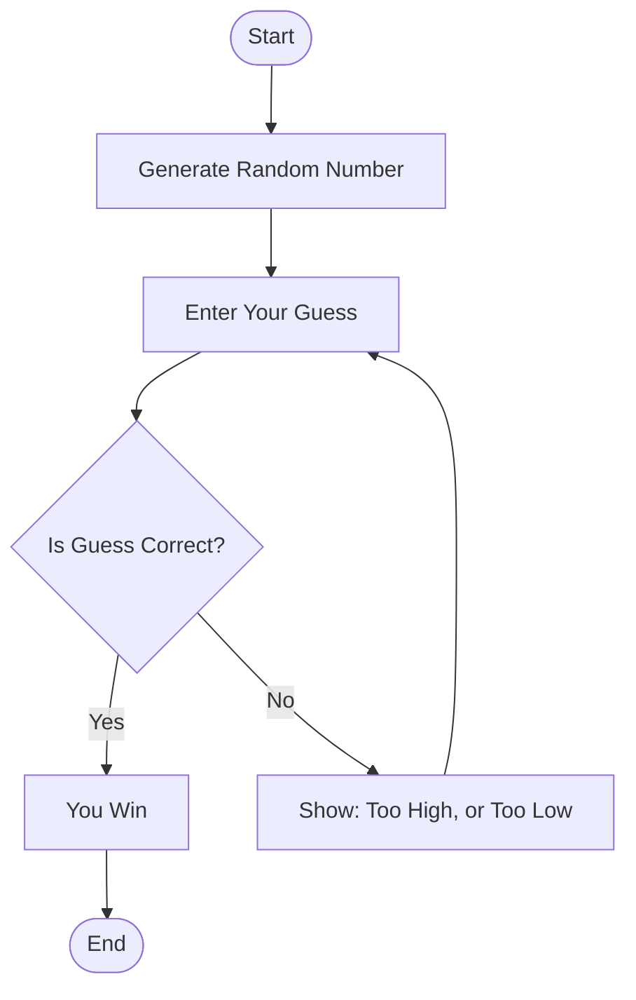

```mermaid
flowchart TD
    Start([Start]) --> GenerateRandom[Generate Random Number]
    GenerateRandom --> EnterYourGuess[Enter Your Guess]
    EnterYourGuess --> IsGuessCorrect{Is Guess Correct?}
    IsGuessCorrect -->|Yes| Win[You Win]
    IsGuessCorrect -->|No| Show[Show: Too High, or Too Low]
    Show --> EnterYourGuess
    Win --> End([End])
```

1. Start the Game.
2. Random number is generated.
3. Enter your Guess.
4. Check if your answer is correct.
5. If "YES" you win.
6. If "NO" try again, based on the hint you get.